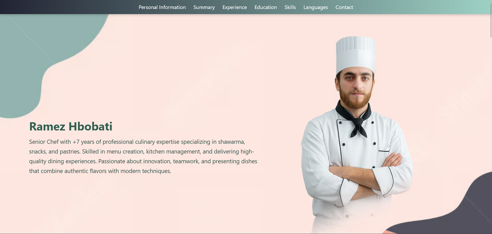
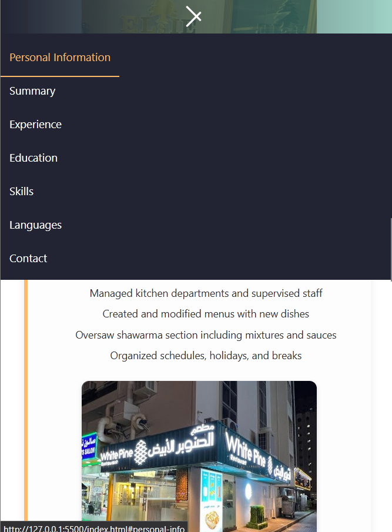

# Chef Portfolio Website

A responsive personal portfolio website for **Chef Mohammad Ramez Hbobati**, showcasing his professional culinary journey, skills, and education.  
Developed using **HTML, CSS, and JavaScript**, the site is fully responsive and optimized for desktop, tablet, and mobile devices.  
This project was built to present a chef’s career path in an elegant, interactive, and visually engaging way.

## 📖 Overview

The website includes:
- A homepage with a personal introduction and photo.
- Structured sections: Personal Information, Summary, Experience, Education, Skills, Languages, and Contact.
- Experience cards with images for each restaurant.
- Responsive navigation menu with a hamburger toggle for mobile devices.

## ✨ Features

- **Responsive Design**: Works seamlessly across desktop, tablet, and mobile.  
- **Interactive Navigation**: Hamburger menu for mobile view.  
- **Experience Showcase**: Detailed career timeline with restaurant photos.  
- **Contact Section**: Direct links to Gmail, Facebook, and Instagram.  
- **Clean Code**: Organized structure using HTML, CSS, and JavaScript.  

## 🛠️ Requirements

- Modern web browser (Chrome, Firefox, Edge, Safari).  
- Text editor or IDE (e.g., VS Code) for modifications.  
- No special setup required — simply open `index.html`.

## 🚀 Installation and Running

1. **Clone the repository**
   ```bash
2. **Open the project:**
   - Navigate to the folder and open it in your editor.

3. **Run the website:**
   - Open `index.html` directly in your browser.

## 📸 Screenshots

- **Homepage**  
  

- **Experience Section (Desktop)**  
  

- **Experience Section (Mobile)**  
  

## 📂 Project Structure

- `index.html` — main page.  
- `css/style.css` — styling.  
- `assets/Images/` — chef photo and restaurant images.  
- `docs/images/` — screenshots for README.  

## 👨‍🍳 Usage

- Browse sections to learn about Chef Ramez’s background and skills.  
- Responsive layout ensures smooth experience on all devices.  
- Easily customizable text and images for updates.  

## 📌 Future Improvements

- Add a dedicated section for recipes or featured dishes.  
- Enhance UI/UX with animations and transitions.  
- Provide multilingual support (Arabic/English).  

---


## By Mohammad Muaaz Hbobati </>


---
